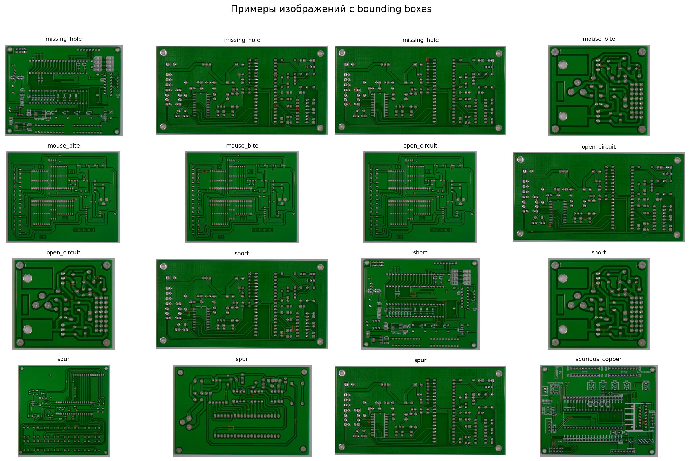
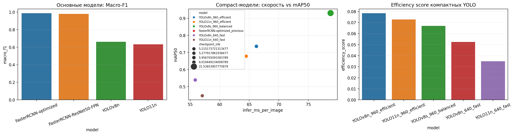

# Обнаружение дефектов печатных плат

Проект по компьютерному зрению для автоматического обнаружения дефектов на печатных платах. Используется датасет [`akhatova/pcb-defects`](https://www.kaggle.com/datasets/akhatova/pcb-defects) с Kaggle.

Финальный ноутбук полностью воспроизводит пайплайн: загрузку данных, EDA, подготовку разметки, обучение моделей, сравнение метрик, анализ ошибок и итоговые выводы.

## Финальный ноутбук

[`pcb_defects_recompute_from_scratch_READY.ipynb`](pcb_defects_recompute_from_scratch_READY.ipynb)

## Классы дефектов

| Класс | Что означает |
|---|---|
| `missing_hole` | Отсутствующее отверстие на плате. |
| `mouse_bite` | Небольшое повреждение края дорожки или области меди, похожее на “укус”. |
| `open_circuit` | Разрыв дорожки, из-за которого электрическая цепь не замыкается. |
| `short` | Короткое замыкание: нежелательное соединение дорожек или медных областей. |
| `spur` | Лишний выступ меди на дорожке. |
| `spurious_copper` | Посторонний фрагмент меди на плате. |

## Сравнение моделей

| Модель | Accuracy | Macro-F1 | mAP50 | mAP50-95 | Скорость, мс/изобр. | Комментарий |
|---|---:|---:|---:|---:|---:|---|
| FasterRCNN-optimized | 0.9856 | 0.9856 | 0.9197 | 0.4684 | 73.3 | Лучшее качество |
| FasterRCNN-ResNet50-FPN | 0.9784 | 0.9785 | 0.9078 | 0.4266 | 114.0 | Сильная базовая модель |
| YOLOv8s_960_balanced | 0.9640 | 0.9810 | 0.9307 | 0.4809 | 78.8 | Лучшая YOLO-модель по качеству |
| YOLOv8n_960_efficient | 0.8345 | 0.8737 | 0.7358 | 0.3648 | 66.2 | Лучшая компактная модель, около 6 MB |
| YOLO11n_960_efficient | 0.7914 | 0.8251 | 0.6781 | 0.3334 | 64.5 | Компактная YOLO11-модель |
| YOLOv8n_640_fast | 0.6763 | 0.7636 | 0.5388 | 0.2534 | 55.9 | Быстрый nano-baseline |
| YOLO11n_640_fast | 0.5252 | 0.5811 | 0.4466 | 0.2098 | 57.0 | Быстрый YOLO11-baseline |

## Визуальные результаты

### Примеры плат с разметкой

### Итоговое сравнение моделей

### Примеры ошибок

## Основные выводы

- Лучшее качество показала модель `FasterRCNN-optimized`.
- Лучшей компактной моделью стала `YOLOv8n_960_efficient`.
- Лучшей YOLO-моделью по качеству стала `YOLOv8s_960_balanced`.
- Увеличение размера входного изображения с `640` до `960` заметно помогло YOLO-моделям, потому что дефекты на платах мелкие.
- Основные ошибки возникают между визуально похожими дефектами меди и дорожек: `mouse_bite`, `open_circuit`, `spur`, `spurious_copper`.
